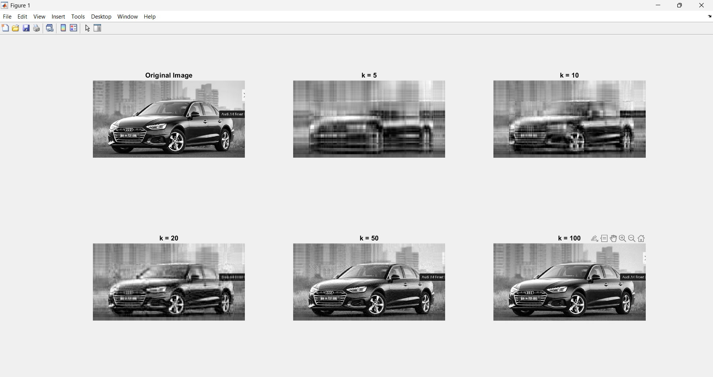
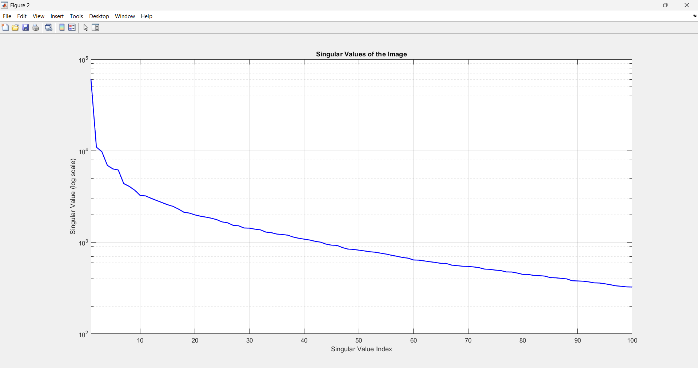
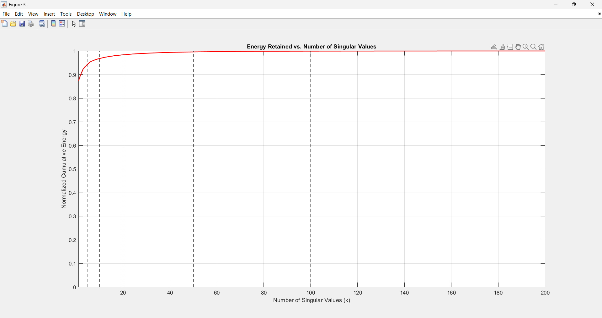

# SVD Image & Video Compression using MATLAB

This project demonstrates **lossy image and video compression using Singular Value Decomposition (SVD)**. It includes:

- **Image Compression**: Compress grayscale images using low-rank SVD approximation.
- **Video Compression**: Real-time, memory-efficient video compression using **incremental subspace learning**.

Both scripts are **educational**, **lightweight**, and **well-commented**.

---

## Features

| Feature | Image | Video |
|-------|--------|--------|
| SVD-based compression | Yes | Yes (incremental) |
| PSNR & Compression Ratio | Yes | Yes |
| Visual comparison | Yes | Yes |
| Save compressed output | No | Yes (`.mp4`) |
| Low memory usage | Yes | Yes |
| Real-time preview | No | Yes |
| Adjustable `k` and resolution | Yes | Yes |

---

## 📸 Image Compression using SVD

### 🔍 Overview
SVD decomposes an image matrix into three matrices — **U**, **S**, and **V** — such that:

\[
A = U S V^T
\]

By keeping only the top **k** singular values, we can reconstruct a compressed version of the image that retains most of its important visual information while reducing storage requirements.

### ⚙️ Steps Performed
1. Load and convert the image to grayscale  
2. Perform **SVD decomposition**  
3. Reconstruct images using different `k` values  
4. Display reconstructed results for each `k`  
5. Plot:
   - Singular values (energy distribution)
   - Cumulative energy vs. number of singular values  

### 📈 Outputs Displayed
- Original and compressed images for `k = [5, 10, 20, 50, 100]`
- Compression Ratio, Mean Squared Error (MSE), and PSNR (Peak Signal-to-Noise Ratio)
- Energy distribution and cumulative energy plots

### 🖼️ Sample Visualization
- Figure 1: Original vs. Compressed Images  

- Figure 2: Singular Values (log scale)  

- Figure 3: Energy Retained Results\Image Result.pngvs. Number of Singular Values  

---

## 🎥 Video Compression using Incremental SVD

### 🔍 Overview
This part performs **real-time video compression** using an **incremental (streaming) SVD** approach.  
Instead of computing a full SVD for all frames (which is memory-intensive), it updates a **low-rank subspace** frame by frame.

### ⚙️ Algorithm Steps
1. Read frames from the input video  
2. Convert each frame to grayscale and downsample (for speed)  
3. Initialize subspace with the first frame  
4. Project each frame onto the subspace and reconstruct it  
5. Incrementally update the subspace basis using QR re-orthogonalization  
6. Write the reconstructed (compressed) frames to a new video  

### 📂 Input / Output
- **Input Video:** `Life.mp4` (replace with your own)
- **Output Video:** `compressed_k20.mp4`
- **Adjustable Parameters:**
  - `k` → Number of singular values to retain
  - `downFactor` → Resolution reduction factor
  - `saveVideo` → Enable/disable saving compressed video

### 🧠 Metrics
- Average PSNR computed across sample frames
- Compression effectiveness vs. quality trade-off

---

## Requirements

- **MATLAB R2018b or later**
- **Toolboxes**:
  - Image Processing Toolbox
  - Computer Vision Toolbox (`VideoReader`, `VideoWriter`)
  - Statistics and Machine Learning Toolbox (`eigs`, `qr`)

